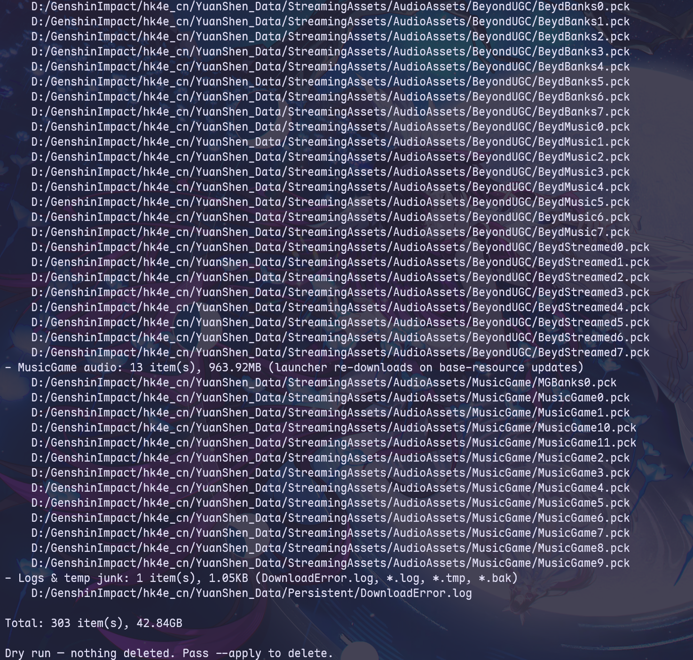

# genshin-cleaner

> Cleans up removable Genshin Impact resources(~43GB with `CNRELWin7.0.0_R47805902_S47829085_D47985349`) without triggering a full integrity check

---

> [!TIP]
> The launcher may restore some files after an update. If that happens, run `genshin-cleaner` again



## Usage

```shell
clean-genshin

clean-genshin "D:\Games\Genshin Impact"

clean-genshin "D:\Games\Genshin Impact" --yes

clean-genshin --editor

clean-genshin --help
```
